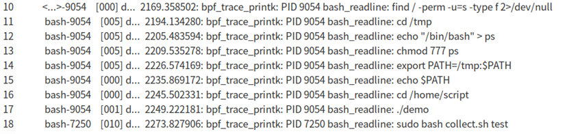

# eBPF Monitoring for EnvVar Operation

This project uses eBPF programs to monitor command line content, thereby achieving monitoring of operations such as environment variable reading and writing. Specifically, we used eunomia-bpf, an eBPF toolchain that completely separates user-space and kernel-space compilation and execution based on libbpf's "compile once, run anywhere" feature, greatly simplifying the launch of eBPF programs.

The eunomia-bpf toolchain includes two tools: the compilation tool `ecc` and the runtime tool `ecli`.

We compile the following eBPF program using `ecc` to generate a `package.json` file:

```c
#include <vmlinux.h>
#include <bpf/bpf_helpers.h>
#include <bpf/bpf_tracing.h>

#define MAX_LINE_SIZE 128

char LICENSE[] SEC("license") = "GPL";

SEC("uretprobe//bin/bash:readline")
int BPF_KRETPROBE(printret, const void *ret)
{
    char str[MAX_LINE_SIZE];
    u32 pid;

    if (!ret)
        return 0;

    pid = bpf_get_current_pid_tgid() >> 32;
    bpf_probe_read_user_str(str, sizeof(str), ret);

    bpf_printk("PID %d bash_readline: %s", pid, str);

    return 0;
};
```

In this code:

- Lines 1-5 include the necessary header files and macro definitions

- Line 7 defines the license to allow the program to run in the kernel
- Line 9 uses the SEC macro to specify the uprobe type, path to the binary file to capture, and the function name to capture
- Line 10 uses the `BPF_KRETPROBE` macro to define the probe function name and parameters
- Line 18 uses the `bpf_get_current_pid_tgid` function to get the current process PID and stores it in the pid variable
- Line 19 uses the `bpf_probe_read_user_str` function to read the return value of the readline function from user space and store it in the str array
- Finally, line 21 uses the `bpf_printk` function to output the PID and user input string

Subsequently, running the `package.json` file with ecli launches the eBPF program. This program saves logs in the `/sys/kernel/debug/tracing/trace_pipe` file, which we redirect to the ebpf directory using the cat command.



Log output showing command line records with PIDs and command content
The program doesn't need to be recompiled before each launch; it can be run directly using the `ecli` tool with the `package.json` file. We have integrated the eBPF program's startup, shutdown, and log collection into the startup script start.sh and collection script collect.sh, which will run alongside auditbeat.
